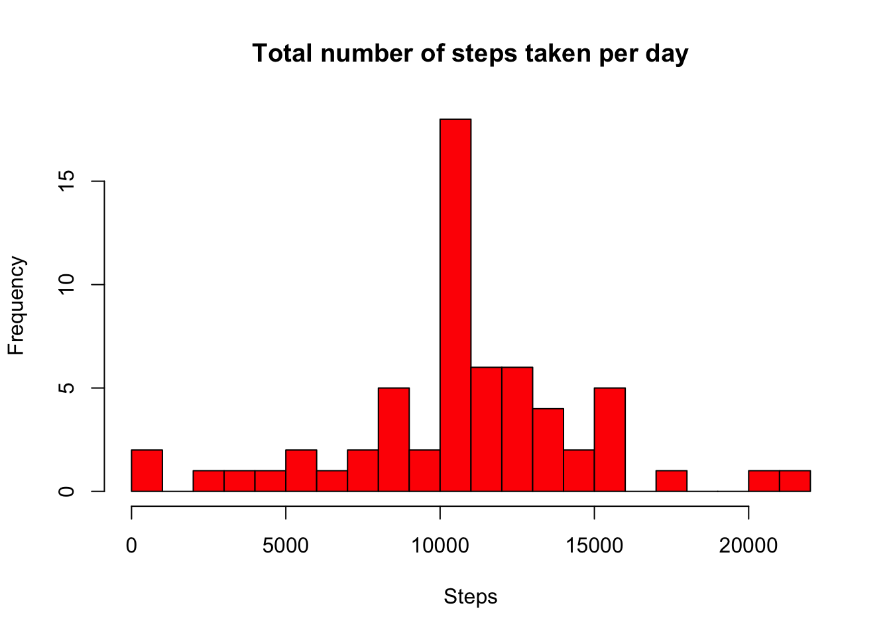

# Reproducible Research: Peer Assessment 1
<br /> 
## Loading and preprocessing the data


```r
data <- read.csv("/Users/local/Desktop/activity.csv", header = TRUE)
```

## What is mean total number of steps taken per day?


```r
library(reshape)

data1 <- data[complete.cases(data), ]
data2 <- tapply(data1$steps, data1$date, sum)
m <- melt(data2)
colnames(m) <- c("date", "steps")

datamean <- mean(m$steps,na.rm=TRUE)
```
### mean

```r
print(datamean)
```

```
## [1] 10766.19
```


```r
datamedian <- median(m$steps,na.rm=TRUE)
```
### median


```r
print(datamedian)
```

```
## [1] 10765
```

```r
hist(m$steps, col = "red", breaks = 30, main = "Total number of steps taken per day", xlab = "Steps",
ylab = "Frequency")
```

 

## What is the average daily activity pattern?

```r
data1 <- data[complete.cases(data), ]
data2 <- tapply(data1$steps, data1$interval, mean)
m <- melt(data2)
colnames(m) <- c("interval", "steps")

plot(m, type="l", ylab="Mean Steps", xlab="5 Min Interval", main="Mean Steps across Interval")
```

 

### 5-min interval containing the maximum number of steps


```r
m[which.max(m$steps),]
```

```
##     interval    steps
## 104      835 206.1698
```

## Imputing missing values

### Total number of missing values 

```r
sum(is.na(data))
```

```
## [1] 2304
```
### We use mean to impute missing data

```r
datamean <- mean(data$steps,na.rm=TRUE)

data$steps[is.na(data$steps)] <-datamean

data2 <- tapply(data$steps, data$date, sum)
m <- melt(data2)
colnames(m) <- c("date", "steps")

datamean <- mean(m$steps,na.rm=TRUE)
```
### mean

```r
print(datamean)
```

```
## [1] 10766.19
```
### median

```r
datamedian <- median(m$steps,na.rm=TRUE)

print(datamedian)
```

```
## [1] 10766.19
```
Comparing imputed and non-imputed data we see that mean stays the same and median on imputed data is slightly higher and gets close to the mean


```r
hist(m$steps, col = "red", breaks = 30, main = "Total number of steps taken per day", xlab = "Steps",
ylab = "Frequency")
```

 

## Are there differences in activity patterns between weekdays and weekends?

```r
library(lattice)


datamean <- mean(data$steps,na.rm=TRUE)

data$steps[is.na(data$steps)] <-datamean

data$days <- "weekday"

data$days[weekdays(as.Date(data$date)) %in% c("Saturday", "Sunday")] <- "weekend"

data$days <- factor(data$days)

data2 <- tapply(data$steps, list(data$days, data$interval), mean)

weekdaydata <- data[data$days == "weekday", ]

weekdaydata <- tapply(weekdaydata$steps, weekdaydata$interval, mean)

weekenddata <- data[data$days == "weekend", ]

weekenddata <- tapply(weekenddata$steps, weekenddata$interval, mean)


m <- melt(data2)

colnames(m) <- c("weekday", "interval", "steps")

xyplot(steps ~ interval|weekday, data = m, type="l", xlab = "5-minute interval",
ylab = "Average number of steps", main = "Average number of steps by weekday and weekend at 5-minute interval", layout = c(1, 2))
```

 

The plots show that on the weekends, the average number of steps taken tends to be higher compared to weekdays. But on the weekdays, there is a higher spike of steps around 800 compared to weekends. 
